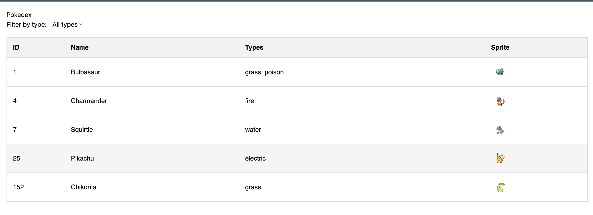

# The Pokedex Problem



This is a React TypeScript project that implements a Pokémon directory (Pokédex). The project uses React Router v7.

## Getting Started

First, install the dependencies:

```bash
pnpm install
```

Then start the development server:

```bash
pnpm dev
```

## Problem Requirements

This project is divided into three parts, each building upon the previous one. Each part focuses on component composition and state management in React.

### Part 1: Create a Pokemon Row Component

Create a `<PokemonRow />` component that displays information about a single Pokémon. The component should:

- Accept a Pokémon object as a prop
- Display the Pokémon's name, ID, type, and sprite (image)

Example of the Pokémon object structure:

```typescript
const bulbasaur = {
  id: 1,
  name: 'Bulbasaur',
  types: ['grass'],
  sprite: 'https://raw.githubusercontent.com/PokeAPI/sprites/master/sprites/pokemon/1.png',
};
```

### Part 2: Create a Pokemon Table Component

Create a `<PokedexTable />` component that:

- Accepts an array of Pokémon objects as a prop
- Renders multiple `<PokemonRow />` components to display all Pokémon in the array

Example of the input array:

```typescript
const pokemonArray = [
  {
    id: 1,
    name: 'Bulbasaur',
    types: ['grass'],
    sprite: 'https://raw.githubusercontent.com/PokeAPI/sprites/master/sprites/pokemon/1.png',
  },
  {
    id: 2,
    // ... more Pokemon objects
  },
];
```

### Part 3: Add Type Filtering

First, create a `<PokemonTypeSelection />` component that:

- Allows users to select a Pokémon type (e.g., "grass", "fire", "water")
- Implements the following TypeScript interface:

```typescript
type PokemonTypeSelectionProps = {
  selectedType: string | undefined;
  onTypeChange: (type: string | undefined) => void;
};
```

Then, create a `<FilterablePokedexTable />` component that:

- Combines your `<PokemonTypeSelection />` and `<PokedexTable />` components
- Uses the type selector to filter the Pokémon list
- Only shows Pokémon that match the selected type
- Shows all Pokémon when no type is selected (undefined)

Think about:

- Where should the filtering logic live?
- How will the components communicate with each other?
- How will you handle the state of the selected type?
